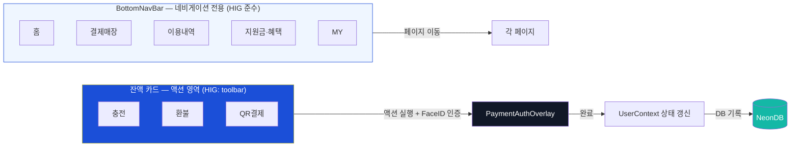
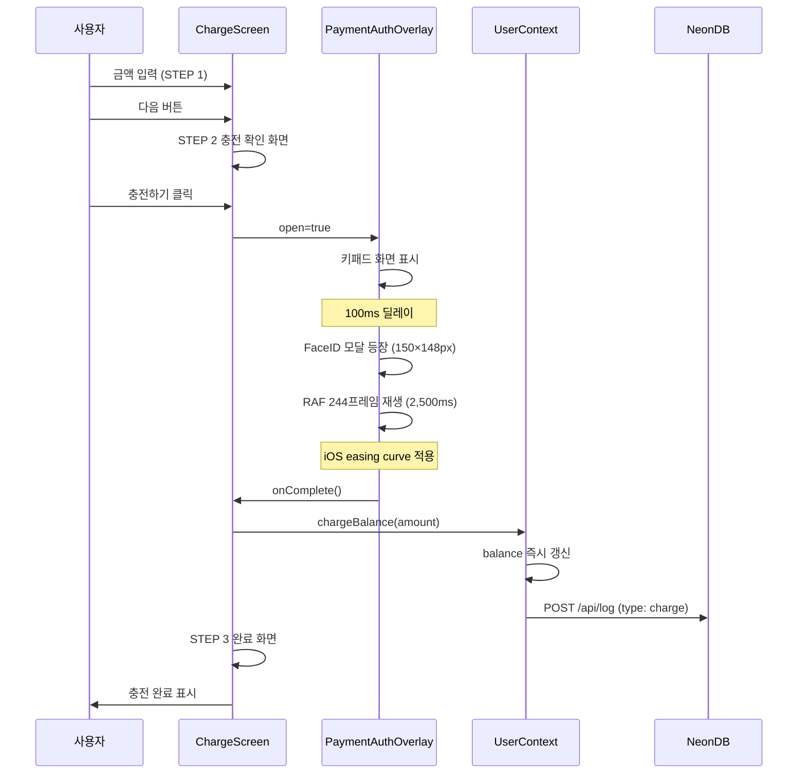
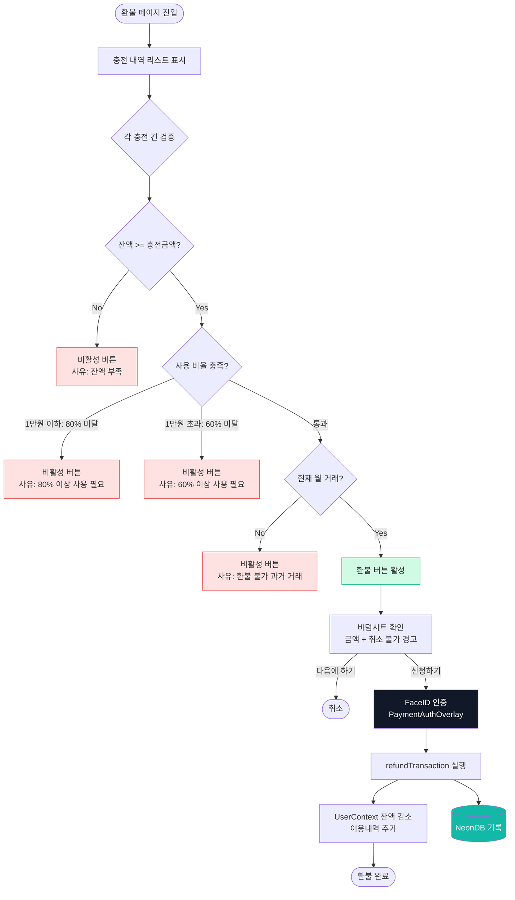
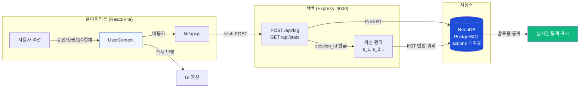

# 강릉페이 IA 다이어그램 모음

생성일: 2026-05-20
용도: 발표 슬라이드/포스터 첨부용 Mermaid 다이어그램

---

## 1. 라우트 트리 (전체 구조)

```mermaid
graph TD
    BottomNav[BottomNavBar 5탭]

    BottomNav --> Home[/ 홈]
    BottomNav --> Store[/store 결제매장]
    BottomNav --> History[/history 이용내역]
    BottomNav --> Support[/support 지원금·혜택]
    BottomNav --> My[/my MY]

    Home --> BalanceCard[잔액 카드 액션 영역]
    BalanceCard --> Charge[/charge 충전]
    BalanceCard --> Refund[/refund 환불]
    BalanceCard --> QR[/qr QR결제]
    Home --> CardApply[/card-apply 카드신청]
    Home --> Cashback[/cashback 캐시백]

    My --> CardMgmt[/card-management 카드관리]
    My --> Settings[/settings 설정]
    My --> CustomerCenter[/customer-center 고객센터]
    My --> Notification[/notification 알림]
    My --> ServiceEdit[/service-edit 가맹점신청]

    Store --> StoreMap[지도 + 매장 검색]
    History --> RefundLink[환불 진입]
    Cashback --> CashbackInfo[/cashback-info 캐시백 안내]

    style BottomNav fill:#1D4ED8,color:#fff
    style BalanceCard fill:#1B4FD8,color:#fff
    style Charge fill:#DBEAFE,stroke:#1D4ED8
    style Refund fill:#FEF3C7,stroke:#F59E0B
    style QR fill:#D1FAE5,stroke:#14B8A6
    style Home fill:#EFF6FF,stroke:#1D4ED8
    style My fill:#EFF6FF,stroke:#1D4ED8
```

---

## 2. BottomNav 5탭 — HIG 준수 네비/액션 분리 구조



---

## 3. 충전 플로우 — FaceID 인증 시퀀스



---

## 4. 환불 플로우 — 3중 조건 검증 + 오류 방지



---

## 5. 데이터 흐름 — 풀스택 연동 구조


